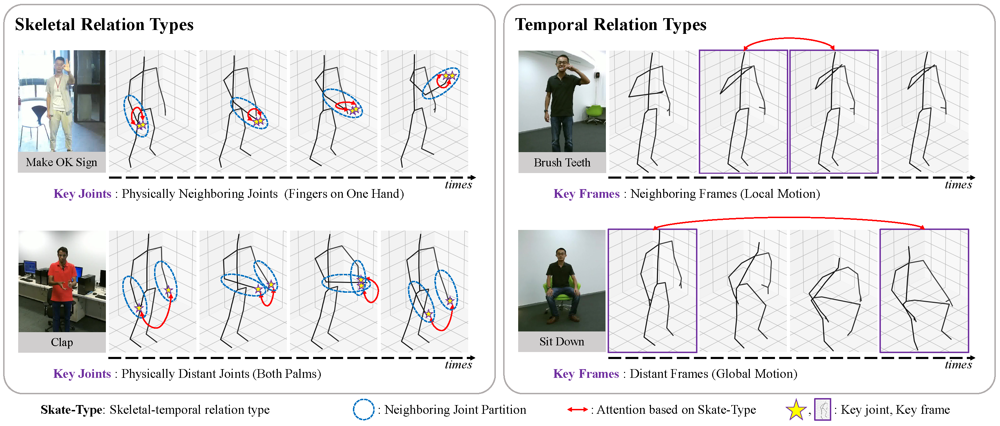
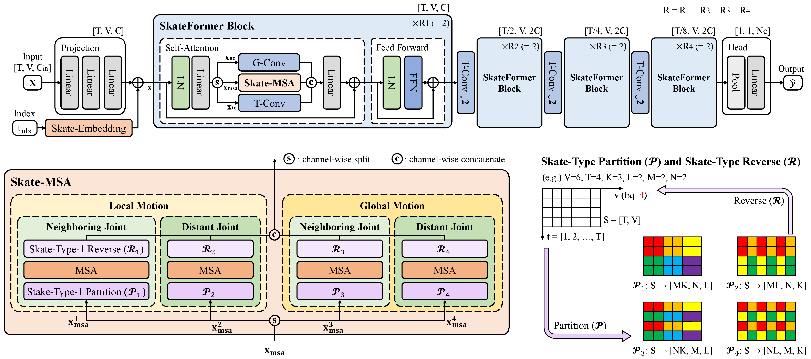

<div align="center">
<h2>SkateFormer: Skeletal-Temporal Transformer for Human Action Recognition (ECCV 2024)</h2>

<div>    
    <a href='https://sites.google.com/view/jeonghyeokdo/' target='_blank'>Jeonghyeok Do</a><sup>1</sup>&nbsp&nbsp&nbsp&nbsp;
    <a href='https://www.viclab.kaist.ac.kr/' target='_blank'>Munchurl Kim</a><sup>†1</sup>
</div>
<br>
<div>
    <sup>†</sup>Corresponding author</span>
</div>
<div>
    <sup>1</sup>Korea Advanced Institute of Science and Technology, South Korea</span>
</div>

<div>
    <h4 align="center">
        <a href="https://kaist-viclab.github.io/SkateFormer_site/" target='_blank'>
        
        </a>
        <a href="https://arxiv.org/abs/2403.09508" target='_blank'>
        
        </a>
        </a>
        <a href="https://www.youtube.com/watch?v=kbYexZ-LfTM" target='_blank'>
        
        </a>
        
    </h4>
</div>
</div>

---

<h4>
This repository is the official PyTorch implementation of "SkateFormer: Skeletal-Temporal Transformer for Human Action Recognition". SkateFormer achieves state-of-the-art performance in both skeleton-based action recognition and interaction recognition.
</h4>



## Network Architecture


---

## 📧 News
- **Sep 26, 2024:** Youtube video about SkateFormer is uploaded :sparkles:
- **Jul 1, 2024:** SkateFormer accepted to ECCV 2024 :tada:
- **Jun 11, 2024:** Codes of SkateFormer (including the training, testing code, and pretrained model) are released :fire:
- **Mar 19, 2024:** This repository is created

---
## Reference
```BibTeX
@inproceedings{do2025skateformer,
  title={Skateformer: skeletal-temporal transformer for human action recognition},
  author={Do, Jeonghyeok and Kim, Munchurl},
  booktitle={European Conference on Computer Vision},
  pages={401--420},
  year={2025},
  organization={Springer}
}
```
---

## Contents
- [Requirements](#requirements)
- [Data Preparation](#data-preparation)
- [Pretrained Model](#pretrained-model)
- [Training](#training)
- [Testing](#testing)
- [Results](#results)
- [License](#license)
- [Acknowledgement](#acknowledgement)

## Requirements
> - Python >= 3.9.16
> - PyTorch >= 1.12.1
> - Platforms: Ubuntu 22.04, CUDA 11.6
> - We have included a dependency file for our experimental environment. To install all dependencies, create a new Anaconda virtual environment and execute the provided file. Run `conda env create -f requirements.yaml`.
> - Run `pip install -e torchlight`.

## Data Preparation

### Download datasets

#### There are 3 datasets to download:

- NTU RGB+D
- NTU RGB+D 120
- NW-UCLA

#### NTU RGB+D and NTU RGB+D 120

1. Request dataset from [here](https://rose1.ntu.edu.sg/dataset/actionRecognition)
2. Download the skeleton-only datasets:
   1. `nturgbd_skeletons_s001_to_s017.zip` (NTU RGB+D)
   2. `nturgbd_skeletons_s018_to_s032.zip` (NTU RGB+D 120)
   3. Extract above files to `./data/nturgbd_raw`

#### NW-UCLA

1. Download dataset from [here](https://www.dropbox.com/s/10pcm4pksjy6mkq/all_sqe.zip?dl=0)
2. Move `all_sqe` to `./data/NW-UCLA`

### Data Processing

#### Directory Structure

- Put downloaded data into the following directory structure:

```
- data/
  - NW-UCLA/
    - all_sqe
      ... # raw data of NW-UCLA
  - ntu/
  - ntu120/
  - nturgbd_raw/
    - nturgb+d_skeletons/     # from `nturgbd_skeletons_s001_to_s017.zip`
      ...
    - nturgb+d_skeletons120/  # from `nturgbd_skeletons_s018_to_s032.zip`
      ...
```

#### Generating Data

- Generate NTU RGB+D or NTU RGB+D 120 dataset:

```
 cd ./data/ntu # or cd ./data/ntu120
 # Get skeleton of each performer
 python get_raw_skes_data.py
 # Remove the bad skeleton 
 python get_raw_denoised_data.py
 # Transform the skeleton to the center of the first frame
 python seq_transformation.py
```

## Pretrained Model
Pre-trained model can be downloaded from [here](https://drive.google.com/file/d/16dBg4nq91dUYqVqB4W0d8r4TzOMe0U2u/view?usp=sharing).
* *pretrained.zip*: trained on NTU RGB+D, NTU RGB+D 120, NTU-Inter, NTU-Inter 120 and NW-UCLA.

## Training
```bash
# Download code
git clone https://github.com/KAIST-VICLab/SkateFormer
cd SkateFormer

# Train SkateFormer on NTU RGB+D X-Sub60 dataset (joint modality)
python main.py --config ./config/train/ntu_cs/SkateFormer_j.yaml

# Train SkateFormer on NTU RGB+D X-Sub60 dataset (bone modality)
python main.py --config ./config/train/ntu_cs/SkateFormer_b.yaml

# Train SkateFormer on NTU-Inter X-View60 dataset (joint modality)
python main.py --config ./config/train/ntu_cv_inter/SkateFormer_j.yaml

# Train SkateFormer on NTU-Inter 120 X-Set120 dataset (joint modality)
python main.py --config ./config/train/ntu120_cset_inter/SkateFormer_j.yaml 

# Train SkateFormer on NW-UCLA dataset (joint modality)
python main.py --config ./config/train/nw_ucla/SkateFormer_j.yaml
```

## Testing
```bash
# Test SkateFormer on NTU RGB+D X-View60 dataset (joint modality)
python main.py --config ./config/test/ntu_cv/SkateFormer_j.yaml

# Test SkateFormer on NTU RGB+D 120 X-Sub120 dataset (joint modality)
python main.py --config ./config/test/ntu120_csub/SkateFormer_j.yaml

# Test SkateFormer on NW-UCLA dataset (bone modality)
python main.py --config ./config/test/nw_ucla/SkateFormer_b.yaml
```

## Results
Please visit our [project page](https://kaist-viclab.github.io/SkateFormer_site/) for more experimental results.

## License
The source codes including the checkpoint can be freely used for research and education only. Any commercial use should get formal permission from the principal investigator (Prof. Munchurl Kim, mkimee@kaist.ac.kr).

## Acknowledgement
This repository is built upon [FMA-Net](https://github.com/KAIST-VICLab/FMA-Net/), with data processing techniques adapted from [SGN](https://github.com/microsoft/SGN) and [HD-GCN](https://github.com/Jho-Yonsei/HD-GCN/).